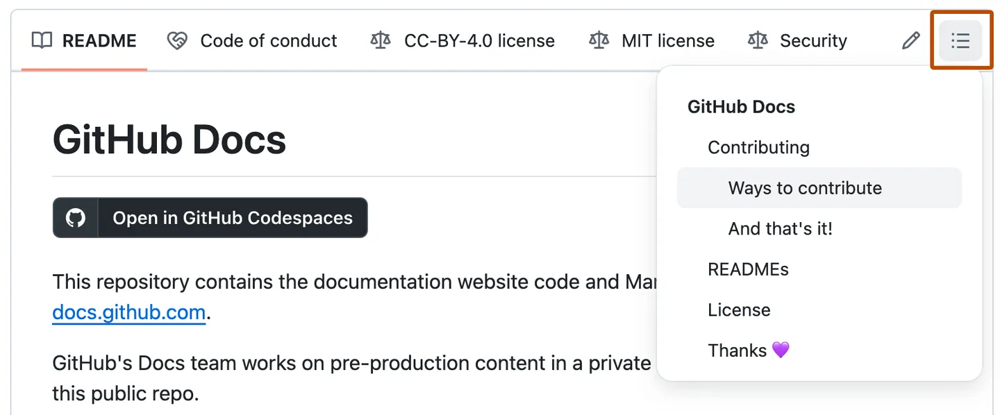

# gfm markdown parsing test

This lab is a syntax tester for external markdown parsing. The parsed elements were pulled from here: https://docs.github.com/en/get-started/writing-on-github/getting-started-with-writing-and-formatting-on-github/basic-writing-and-formatting-syntax

## Headings

# A first-level heading
## A second-level heading
### A third-level heading
#### A fourth-level heading
##### A fifth-level heading
###### A sixth-level heading

Github will generate a table of contents *outside* of the markdown if you add two pr more headers


## Styling text

| Style                  | Syntax      | Example                                |
|------------------------|-------------|----------------------------------------|
| Bold                   | `**`        | **bold text**                          |
| Bold                   | `__`        | __bold text__                          |
| Italic                 | `*`         | *italic text*                          |
| Italic                 | `_`         | _italic text_                          |
| Strikethrough          | `~~`        | ~~strikethrough text~~                 |
| Strikethrough          | `~`         | ~strikethrough text~                   |
| Bold and nested italic | `**` and `_` | **bold and _nested italic_ text**      |
| All bold and italic    | `***`       | ***all bold and italic text***         |
| Subscript              | `<sub>`     | Example of <sub>subscript</sub> text   |
| Superscript            | `<sup>`     | Example of <sup>superscript</sup> text |
| Underline              | `<ins>`     | <ins>underline text</ins>              |

## Quoting text

Text that is not a quote

> Text that is a quote

## Quoting code

Use a single \` for a code block e.g.

Use `git status` to list all new or modified files that haven't yet been committed.

use triple backticks for a distinct code block \`\`\` e.g.

Some basic Git commands are:
```
git status
git add
git commit
```

## Supported colour models

| Type | Syntax       | Example              |
|------|--------------|----------------------|
| HEX  | `#RRGGBB`    | `#0969DA`            |
| RGB  | `rgb(R,G,B)` | `rgb(9, 105, 218)`   |
| HSL  | `hsl(H,S,L)` | `hsl(212, 92%, 45%)` |

The visualization of the color is only supported in issues, pull requests, and discussions.

## Links

You can create a link by wrapping the link text in `[]` and the URL in `()`

This site was built using [This sample was populated using examples from here](https://docs.github.com/en/get-started/writing-on-github/getting-started-with-writing-and-formatting-on-github/basic-writing-and-formatting-syntax)

## Section Links

### Example headings

#### Sample Section

#### This'll be a _Helpful_ Section About the Greek Letter Θ!
A heading containing characters not allowed in fragments, UTF-8 characters, two consecutive spaces between the first and second words, and formatting.

#### This heading is not unique in the file

TEXT 1

#### This heading is not unique in the file

TEXT 2

### Links to the example headings above

Link to the sample section: [Link Text](#sample-section).

Link to the helpful section: [Link Text](#thisll-be-a-helpful-section-about-the-greek-letter-Θ).

Link to the first non-unique section: [Link Text](#this-heading-is-not-unique-in-the-file).

Link to the second non-unique section: [Link Text](#this-heading-is-not-unique-in-the-file-1).

## Relative links

You can define relative links by wrapping the link text in `[]` and the URL in `()` and using a relative path e.g. `./relative-link.md`

[Relative link](./relative-link.md)

## Custom anchors

Some body text of this section.

<a name="my-custom-anchor-point"></a>
Some text I want to provide a direct link to, but which doesn't have its own heading.

(… more content…)

[A link to that custom anchor](#my-custom-anchor-point)

## Line breaks

`linebreak`\
This should render
on one line

`\ backslash`\
This should render\
on two lines

`<br/>`\
this should render <br/>
on two lines 

`blank line`\
this should render

on two lines separated by a space

## Images

You can add images by adding a `!` and then `[]` for the alt text and the link in `()`


you can also use the `picture` html element

```
<picture>
    
</picture>
```

<picture>
    
</picture>

## Lists

You can create an unordered list by preceding one or more lines of text with `-`, `*`, or `+`

- list item 1 `-`
- list item 2 `-`
- list item 3 `-`

* list item 1 `*`
* list item 2 `*`
* list item 3 `*`

+ list item 1 `+`
+ list item 2 `+`
+ list item 3 `+`

An ordered list requires a number and `.` preceding the list item

1. list item 1
2. list item 2
3. list item 3

## Nested list

1. list item 1
   - nested item 1 (`-`)
     * nested item 2 (`*`)
       + nested item 3 (`+`)

To indent you need to match the number of characters before the preceding list item e.g.

`1. example 1` would require 3 spaces before a nested item `  - nested 1`\
Whereas `100. example 2` would require 5 spaces before a nested item:

```
100. example 2
     - nested item 1
```

100. example 2
     - nested item 1

## Task lists

To create a task list, preface list items with a hyphen and space followed by `[ ]`. To mark a task as complete, use `[x]`

- [x] #739
- [ ] https://github.com/octo-org/octo-repo/issues/740
- [ ] Add delight to the experience when all tasks are complete :tada:

If a task list item description begins with a parenthesis, you'll need to escape it with \:

- [ ] \(Optional) Open a followup issue

## Emoji

You can add emoji to your writing by using `:EmojiCode:` :+1:

## Paragraphs

Paragraphs are formatted leaving a blank space between lines of text:

Paragraph 1

Paragraph 2

Paragraph 3

## Footnotes

Here is a simple footnote[^1].

A footnote can also have multiple lines[^2].

[^1]: My reference.
[^2]: To add line breaks within a footnote, prefix new lines with 2 spaces.
This is a second line.

## Alerts

> [!NOTE]
> Useful information that users should know, even when skimming content.

> [!TIP]
> Helpful advice for doing things better or more easily.

> [!IMPORTANT]
> Key information users need to know to achieve their goal.

> [!WARNING]
> Urgent info that needs immediate user attention to avoid problems.

> [!CAUTION]
> Advises about risks or negative outcomes of certain actions.

## Hiding content with comments 

The following syntax should prevent text being rendered in markdown

`<!-- -->`

<!-- This content will not appear in the rendered Markdown -->

## Ignoring markdown formatting

The backslash character should allow you to escape Markdown formatting if you put it before a Markdown character.

Let's rename \*our-new-project\* to \*our-old-project\*.

## Advanced formatting

GFM has a number of advanced formatting options, the following are applicable to my usecase.

## Creating a table

| First Header  | Second Header |
| ------------- | ------------- |
| Content Cell  | Content Cell  |
| Content Cell  | Content Cell  |

Pipes should not need to be aligned for cells to align correctly.

| Command | Description |
| --- | --- |
| git status | List all new or modified files |
| git diff | Show file differences that haven't been staged |

## Formatting content within a table

You can format cell data within the your table

| Command | Description |
| --- | --- |
| `git status` | List all *new or modified* files |
| `git diff` | Show file differences that **haven't been** staged |

You can align columns in your table

| Left-aligned | Center-aligned | Right-aligned |
| :---         |     :---:      |          ---: |
| git status   | git status     | git status    |
| git diff     | git diff       | git diff      |

You can escape the `|` character to include one in your cell

| Name     | Character |
| ---      | ---       |
| Backtick | `         |
| Pipe     | \|        |

## Collapsed sections

<details>

<summary>Tips for collapsed sections</summary>

### You can add a header

You can add text within a collapsed section.

You can add an image or a code block, too.

```ruby
   puts "Hello World"
```

</details>

<details open>

<summary>Collapsed sections can be open by default</summary>

Just use this syntax `<details open>`

</details>

## Fenced code blocks

```
function test() {
  console.log("notice the blank line before this function?");
}
```

You can show triple backticks by using quadruple backticks around the code block

````
```
Look! You can see my backticks.
```
````

## Syntax highlighting

Adding a language identifier enables syntax highlighting in your fenced in code block

```ruby
require 'redcarpet'
markdown = Redcarpet.new("Hello World!")
puts markdown.to_html
```

## Writing inline mathematical expressions

This sentence uses `$` delimiters to show math inline: $\sqrt{3x-1}+(1+x)^2$

This sentence uses $\` and \`$ delimiters to show math inline: $`\sqrt{3x-1}+(1+x)^2`$

## Writing mathematical expressions as blocks

**The Cauchy-Schwarz Inequality**\
$$\left( \sum_{k=1}^n a_k b_k \right)^2 \leq \left( \sum_{k=1}^n a_k^2 \right) \left( \sum_{k=1}^n b_k^2 \right)$$

**The Cauchy-Schwarz Inequality**

```math
\left( \sum_{k=1}^n a_k b_k \right)^2 \leq \left( \sum_{k=1}^n a_k^2 \right) \left( \sum_{k=1}^n b_k^2 \right)
```

## Escaping the `$` character witin a mathematical expression

This expression uses `\$` to display a dollar sign: $`\sqrt{\$4}`$

To split <span>$</span>100 in half, we calculate $100/2$

## Autolink URLs

Visit https://github.com

## What I've excluded

- Mentioning people and teams (in github)
- Referencing issues and pull requests
- Uploading assets
- Creating Mermaid, GeoJSON, TopoJSON, and ASCII ST diagrams
- Autolinking issues and pull requests, commits, labels
- Attaching files it issues and pull requests
- Tasklists re-ordering and converting to issues
- Linking to code
